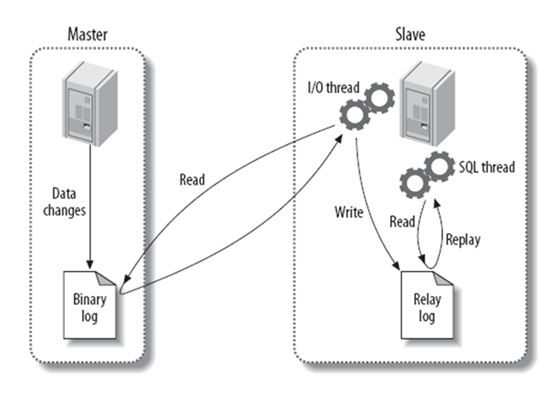

# Mysql主从复制

### 为什么需要主从复制

1，使用主从复制，让主库负责写，从库负责读，这样，即使主库出现了锁表的情景，通过读从库也可以保证业务的正常运作。

2，架构的扩展。业务量越来越大，I/O访问频率过高，单机无法满足，此时做多库的存储，降低磁盘I/O访问的频率，提高单个机器的I/O性能。

3，主从多台服务器，同样也可以当作数据备份的。

### 主从复制原理

（1）master服务器将数据的改变记录二进制binlog日志，当master上的数据发生改变时，则将其改变写入二进制日志中；

（2）slave服务器会在一定时间间隔内对master二进制日志进行探测其是否发生改变，如果发生改变，则开始一个I/O Thread请求master二进制事件；

（3）同时主节点为每个I/O线程启动一个dump线程，用于向其发送二进制事件，并保存至从节点本地的中继日志中，从节点将启动SQL线程从中继日志中读取二进制日志，在本地重放，使得其数据和主节点的保持一致，最后I/OThread和SQLThread将进入睡眠状态，等待下一次被唤醒。

```
也就是说：
从库会生成两个线程,一个I/O线程,一个SQL线程;
I/O线程会去请求主库的binlog，并将得到的binlog写到本地的relay-log(中继日志)文件中;
主库会生成一个log dump线程,用来给从库I/O线程传binlog;
SQL线程,会读取relay log文件中的日志,并解析成sql语句逐一执行;
```


