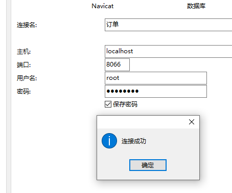

# MyCat解决本地连接多个分片库

### Mycat介绍

Mycat是一个开源的分布式数据库系统，是一个实现了MySQL 协议的的Server，前端用户可以把它看作是一个数据库代理，用MySQL
客户端工具和命令行访问，而其后端可以用MySQL 原生（Native）协议与多个MySQL 服务器通信，也可以用JDBC
协议与大多数主流数据库服务器通信，其核心功能是分表分库，即将一个大表水平分割为N 个小表，存储在后端MySQL
服务器里或者其他数据库里。

### MyCat下载

下载地址（扫码关注：输入：960810，获取到下载地址）


### 配置文件说明

主要配置三个文件

数据库信息配置（分片，读写分离等）：schema.xml

分片规则：rule.xml

系统信息：server.xml


#### schema.xml
schema下：我这里列举了两中表结构，其中order表是order_id为主键，一对一的。order_all_promotion表是id为主键（分片库下需确保id不重复），order
与之是一对多的关系，我这里所有的表都是按照orderId进行分片。rule=mod-long-orderId是分片规则，在后续rule.xml中说明

dataNode下：有两个数据源，order0和order1，数据库名字都为hotel_order2，其中order0的数据库配置配了专门的读写分离

```xml
<?xml version="1.0"?>
<!DOCTYPE mycat:schema SYSTEM "schema.dtd">
<mycat:schema xmlns:mycat="http://io.mycat/">
    <!-- 表规则 -->
	<schema name="hotel_order2" checkSQLschema="true" sqlMaxLimit="10000">
		<!-- 下面是一对一 -->
		<table name="order" primaryKey="order_id" autoIncrement="false" dataNode="dn0,dn1,dn2,dn3" rule="mod-long-orderId"/>
		<!-- 下面是一对多 -->
		<table name="order_all_promotion" primaryKey="id" autoIncrement="false" dataNode="dn0,dn1,dn2,dn3" rule="mod-long-orderId"/>
    </schema>
	
	<dataNode name="dn0" dataHost="order0" database="hotel_order2" />
	<dataNode name="dn1" dataHost="order1" database="hotel_order2" />

	<dataHost name="order0" maxCon="1000" minCon="10" balance="0" writeType="0" dbType="mysql" dbDriver="native" switchType="1" slaveThreshold="100">
		<heartbeat>select 1;</heartbeat>
		<writeHost host="hostM1" url="host1:port1" user="username" password="password">
            <readHost host="hostS2" url="host1:port1" user="username" password="password" />
		</writeHost>
	</dataHost>

	<dataHost name="order1" maxCon="1000" minCon="10" balance="0" writeType="0" dbType="mysql" dbDriver="native" switchType="1" slaveThreshold="100">
		<heartbeat>select 1;</heartbeat>
        <writeHost host="hostM1" url="host2:port2" user="username" password="password">
        </writeHost>
	</dataHost>
</mycat:schema>
```


#### rule.xml

该文件主要配置了很多分片规则（取模，固定，时间，按字段等等等），因为我们就用到了取模，这里对取模做演示，其他的百度了解。

下面配置了取模分片，摸为2，去分片命中前面配置的数据库。tableRule下的name就是我们在schema中的rule

```xml
<?xml version="1.0" encoding="UTF-8"?>
<!DOCTYPE mycat:rule SYSTEM "rule.dtd">
<mycat:rule xmlns:mycat="http://io.mycat/">
	<tableRule name="mod-long-orderId">
		<rule>
			<columns>order_id</columns>
			<algorithm>mod-long</algorithm>
		</rule>
	</tableRule>
	<function name="mod-long" class="io.mycat.route.function.PartitionByMod">
		<!-- how many data nodes -->
		<property name="count">2</property>
	</function>
</mycat:rule>

```

#### server.xml

其中配置基本不用改，只需要配置一个新的账户名和密码，用于连接mycat服务

schemas需要与原schema.xml中的name一致。

```xml
<?xml version="1.0" encoding="UTF-8"?>
<!DOCTYPE mycat:server SYSTEM "server.dtd">
<mycat:server xmlns:mycat="http://io.mycat/">
    <system>
        <!-- 参考配置文件的解释说明进行配置 -->
    </system>

    <user name="root">
        <property name="password">admin</property>
        <property name="schemas">hotel_order2</property>
    </user>
</mycat:server>

```

#### 启动使用

注意：需要将schema.xml复制一份newSchema.xml，和rule.xml复制一份newRule.xml，排除运行不了的情况

直接到bin目录下，双击startup_nowrap.bat运行，启动mycat服务（默认端口8066）

#### 后台运行

在系统启动目录下（win+R 输入 shell:Startup） 新建脚本文件mycat.bat（这样的话开机会自动启动）

```shell
@echo off
if "%1" == "h" goto begin
mshta vbscript:createobject("wscript.shell").run("%~nx0 h",0)(window.close)&&exit
:begin

cd 目录\mycat\bin
startup_nowrap.bat
```

这样就可以在本地连接8066端口，使用配置的账号密码root/admin进行连接，可以单库中操作所有的分片库了

