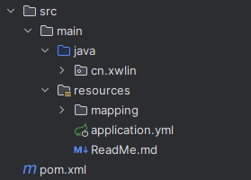

# 集成Mybatis
### 集成Mybatis需要的jar包
数据库连接驱动包  
mybatis框架包

```xml
<dependency>
    <groupId>mysql</groupId>
    <artifactId>mysql-connector-java</artifactId>
    <version>8.0.21</version>
</dependency>
<dependency>
    <groupId>org.mybatis.spring.boot</groupId>
    <artifactId>mybatis-spring-boot-starter</artifactId>
    <version>1.3.0</version>
</dependency>
```

### 数据库准备
```sql
CREATE TABLE `user_info` (
  `id` bigint NOT NULL AUTO_INCREMENT,
  `name` varchar(255) CHARACTER SET utf8mb4 COLLATE utf8mb4_0900_ai_ci DEFAULT NULL,
  `created` datetime DEFAULT NULL,
  PRIMARY KEY (`id`)
) ENGINE=InnoDB;
```

### 增加数据库配置
```properties
spring:
  datasource:
    url: jdbc:mysql://127.0.0.1:3306/cnxwlin?useUnicode=true&characterEncoding=UTF-8&useSSL=false
    driver-class-name: com.mysql.jdbc.Driver
    username: root
    password: admin
mybatis:
    ## mybatis映射文件路径
    mapper-locations: classpath:mapping/*.xml
    ## 别名包（xml中可以不需要全路径）
    type-aliases-package: cn.xwlin.entity
```

### 项目结构


### 编写简单业务代码
查询接口类

POJO类（叫法可能有所不同，与数据库映射对象）
```java
// 使用lombok注解省略getter和setter方法
@Getter
@Setter
public class UserInfo {
    private Long id;
    private String name;
    private Date created;
}
```

```java
@Mapper
public interface UserMapper {
    // @Param注解用于表明当前参数名，可以直接引用#{id}（不然使用序号作为参数,如#{0}）
    UserInfo findById(@Param("id") Long id);
}
```

XML查询语句映射
```xml
<?xml version="1.0" encoding="UTF-8"?>
<!DOCTYPE mapper PUBLIC "-//mybatis.org//DTD Mapper 3.0//EN"
        "http://mybatis.org/dtd/mybatis-3-mapper.dtd">
<mapper namespace="cn.xwlin.dao.UserMapper">
    <!-- 具体的执行Sql，namespace需要映射到接口类，id为接口方法名 -->
    <select id="findById" resultType="cn.xwlin.entity.UserInfo">
        select * from user_info where id = #{id}
    </select>
</mapper>
```

Service业务层
```java
@Service
public class UserService {
    @Autowired
    private UserMapper userMapper;

    public UserInfo getId(Long id) {
        return userMapper.findById(id);
    }
}
```

Controller请求层
```java
@RestController
@RequestMapping("user")
public class UserController {
    @Autowired
    private HelloService helloService;
        
    @RequestMapping("getById")
    public UserInfo getById(Long id) {
      return helloService.getId(id);
    }
}
```

#### 集成之后访问
访问地址: 127.0.0.1:8080/user/getById?id=1  
返回效果：返回数据库中的userInfo信息

集成MyBatis成功  
说明：增删改查都可以用，可以进行尝试
