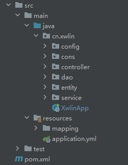

# 生产环境SpringBoot项目结构与配置

### 整体项目结构


### pom.xml
```xml
<parent>
    <groupId>org.springframework.boot</groupId>
    <artifactId>spring-boot-starter-parent</artifactId>
    <version>2.6.4</version>
</parent>
<properties>
    <jdk.version>1.8</jdk.version>
    <project.build.sourceEncoding>UTF-8</project.build.sourceEncoding>
    <maven.compiler.encoding>UTF-8</maven.compiler.encoding>
</properties>
<dependencies>
    <dependency>
        <groupId>org.springframework.boot</groupId>
        <artifactId>spring-boot-starter-web</artifactId>
    </dependency>
    <dependency>
        <groupId>org.springframework.boot</groupId>
        <artifactId>spring-boot-starter-validation</artifactId>
    </dependency>
    <dependency>
        <groupId>org.springframework.boot</groupId>
        <artifactId>spring-boot-starter-aop</artifactId>
    </dependency>
    <dependency>
        <groupId>mysql</groupId>
        <artifactId>mysql-connector-java</artifactId>
        <version>8.0.21</version>
    </dependency>
    <dependency>
        <groupId>com.alibaba</groupId>
        <artifactId>druid-spring-boot-starter</artifactId>
        <version>1.2.6</version>
    </dependency>
    <dependency>
        <groupId>org.mybatis.spring.boot</groupId>
        <artifactId>mybatis-spring-boot-starter</artifactId>
        <version>1.3.0</version>
    </dependency>
    <dependency>
        <groupId>com.github.pagehelper</groupId>
        <artifactId>pagehelper-spring-boot-starter</artifactId>
        <version>1.4.6</version>
    </dependency>
    <dependency>
        <groupId>com.alibaba.fastjson2</groupId>
        <artifactId>fastjson2</artifactId>
        <version>2.0.33</version>
    </dependency>
    <dependency>
        <groupId>com.alibaba.fastjson2</groupId>
        <artifactId>fastjson2-extension-spring5</artifactId>
        <version>2.0.33</version>
    </dependency>
    <dependency>
        <groupId>org.projectlombok</groupId>
        <artifactId>lombok</artifactId>
        <version>1.18.22</version>
    </dependency>
    <dependency>
        <groupId>ch.qos.logback</groupId>
        <artifactId>logback-core</artifactId>
        <version>1.2.10</version>
    </dependency>
    <dependency>
        <groupId>ch.qos.logback</groupId>
        <artifactId>logback-classic</artifactId>
        <version>1.2.10</version>
    </dependency>
    <!-- 集成hutools利用工具类 -->
    <dependency>
        <groupId>cn.hutool</groupId>
        <artifactId>hutool-all</artifactId>
        <version>5.8.3</version>
    </dependency>
    <!-- 对时间非常友好的操作类 -->
    <dependency>
        <groupId>joda-time</groupId>
        <artifactId>joda-time</artifactId>
        <version>2.10.10</version>
    </dependency>
</dependencies>
```


### application.yml
```yaml
server:
  port: 8080
spring:
  datasource:
    name: druidDataSource
    type: com.alibaba.druid.pool.DruidDataSource
    driver-class-name: com.mysql.cj.jdbc.Driver
    url: jdbc:mysql://url:port/dbname?useUnicode=true&characterEncoding=UTF-8&useSSL=false
    username: xwlin
    password: xwlin.pass
    druid:
      #初始化连接池的连接数量 大小，最小，最大
      initial-size: 2
      min-idle: 2
      max-active: 2
      #配置获取连接等待超时的时间
      max-wait: 60000
      #配置间隔多久才进行一次检测，检测需要关闭的空闲连接，单位是毫秒
      time-between-eviction-runs-millis: 60000
      # 配置一个连接在池中最小生存的时间，单位是毫秒
      min-evictable-idle-time-millis: 30000
      # 配置一个连接在池中最大生存的时间，单位是毫秒
      max-evictable-idle-time-millis: 300000
      validation-query: SELECT 1 FROM dual
      test-while-idle: true
      test-on-borrow: true
      test-on-return: false
      # 是否缓存preparedStatement，也就是PSCache  官方建议MySQL下建议关闭   个人建议如果想用SQL防火墙 建议打开
      pool-prepared-statements: true
      max-pool-prepared-statement-per-connection-size: 20
      # 配置监控统计拦截的filters，去掉后监控界面sql无法统计，'wall'用于防火墙
      filters: stat,wall,slf4j
      filter:
        stat:
          merge-sql: true
          slow-sql-millis: 5000
mybatis:
  mapper-locations: classpath:mapping/*.xml
  type-aliases-package: cn.xwlin.entity
pagehelper:
  helperDialect: mysql
  reasonable: true
  supportMethodsArguments: true
  params: count=countSql
```

#### PageHelper使用方式  
```java
public PageInfo<User> findDemoList(int page, int size) {
    // 查询页数信息
    PageHelper.startPage(page, size);
    List<User> userList = userMapper.findAll();
    // 构建结果集（包含分页相关信息）
    PageInfo<User> userListPageInfo = new PageInfo<>(userList);
    return userListPageInfo;
}
```

### 常用配置
#### 请求结果序列化
JsonMessageConverterConfigurer
```java
@Configuration
public class JsonMessageConverterConfigurer implements WebMvcConfigurer {
  @Override
  public void configureMessageConverters(List<HttpMessageConverter<?>> converters) {
    FastJsonConfig config = new FastJsonConfig();
    config.setCharset(StandardCharsets.UTF_8);
    // 时间格式化
    config.setDateFormat("yyyy-MM-dd HH:mm:ss");
    // 配置序列化的行为(按需配置)
    config.setWriterFeatures(
            JSONWriter.Feature.PrettyFormat,
            JSONWriter.Feature.WriteNullStringAsEmpty,
            JSONWriter.Feature.WriteNullListAsEmpty);

    List<MediaType> fastMediaTypes = new ArrayList<>();
    fastMediaTypes.add(MediaType.APPLICATION_JSON);
    // 添加序列化工具
    FastJsonHttpMessageConverter converter = new FastJsonHttpMessageConverter();
    converter.setFastJsonConfig(config);
    converter.setSupportedMediaTypes(fastMediaTypes);
    converter.setDefaultCharset(StandardCharsets.UTF_8);
    converters.add(0, converter);
  }
}
```

#### 全局异常拦截
```java
/**
 * valid参数校验异常包括MethodArgumentNotValidException、BindException、ConstraintViolationException
 * 其中可拦截你的自定义业务异常，返回特定Response
 */
@RestControllerAdvice
public class GlobalExceptionHandler {

  @org.springframework.web.bind.annotation.ExceptionHandler(MethodArgumentNotValidException.class)
  public String handle(MethodArgumentNotValidException e) {
    e.printStackTrace();
    return e.getBindingResult().getFieldError().getDefaultMessage();
  }

  @org.springframework.web.bind.annotation.ExceptionHandler(BindException.class)
  public String handle(BindException e) {
    e.printStackTrace();
    return e.getBindingResult().getFieldError().getDefaultMessage();
  }

  @org.springframework.web.bind.annotation.ExceptionHandler(ConstraintViolationException.class)
  public String handle(ConstraintViolationException e) {
    e.printStackTrace();
    StringBuffer sb = new StringBuffer();
    for (ConstraintViolation<?> violation : e.getConstraintViolations()) {
      sb.append(violation.getMessage());
    }
    return sb.toString();
  }
}
```

### 其他功能
#### 单机订单任务
用于一定周期执行特定的业务逻辑
使用定时任务事，启动类需加注解@EnableScheduling
```java
@Configuration
@EnableScheduling
public class SaticScheduleTask {
  // 可以注入Bean
  @Autowired
  private UserDao userDao;
  
  // 有效的cron表达式（cron表达式自行了解）
  @Scheduled(cron = "0/5 * * * * ?")
  private void configureTasks() {
    // 执行具体的业务逻辑
  }
}
```
<br>
后续有更多的实用配置，会陆续更新。。。。。