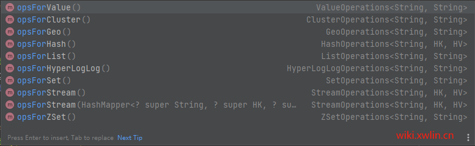
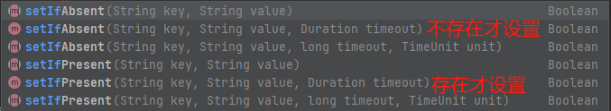

# SpringBoot集成Redis

这里默认你已经集成了SpringBoot环境
### 引用Redis到项目
```xml
<dependency>
    <groupId>org.springframework.boot</groupId>
    <artifactId>spring-boot-starter-data-redis</artifactId>
</dependency>
```

### 增加Redis链接配置
```yaml
spring:
  redis:
    host: redisHost
    port: redisPort
    # 选择槽
    database: 0
    # 密码（没有可删除）
    #password: redis.pass
```

### 使用Redis
```java
@RestController
@RequestMapping("redis")
public class RedisController {

  @Autowired
  private StringRedisTemplate redisTemplate;

  @RequestMapping("set")
  public String info(String key, String value) {
    redisTemplate.opsForValue().set(key, value);
    return "OK";
  }

  @RequestMapping("get")
  public String get(String key) {
    return redisTemplate.opsForValue().get(key);
  }
}
```

这里使用了最简单的key-value格式的数据操作，redisTemplate支持绝大多数的数据操作（见下图）


这里不展示所有数据类型的操作了，如果你需要使用redis，那么你需要去了解他支持的数据结构。


### Redis扩展
Redis锁：redis命令在内部处理时，可以理解为redis服务器是单线程对命令进行处理；当我们需要控制严格执行顺序或避免出现竞争时是非常好的帮手；
  
Redis队列：当你需要通知某个系统时，可以使用Redis队列操作，B应用监听redis队列，A系统往队列推数据（不推荐，有专门的消息队列系统）。  
<br>
<br>
Redis有很多的运用场景，是系统级别不可获取的组件。