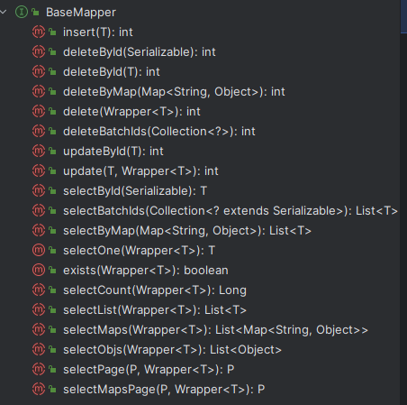
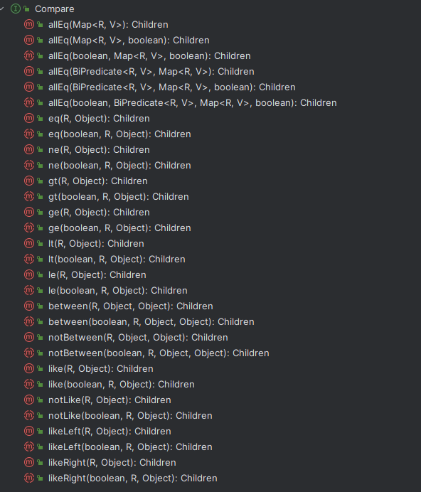

# MybatisPlus集成与运用

### MybatisPlus介绍

#### 官方介绍

MyBatis-Plus（简称 MP）是一个 MyBatis (opens new window)的增强工具，在 MyBatis 的基础上只做增强不做改变，为简化开发、提高效率而生。

#### 特点

- 无侵入：只做增强不做改变，引入它不会对现有工程产生影响，如丝般顺滑
- 损耗小：启动即会自动注入基本 CURD，性能基本无损耗，直接面向对象操作
- 强大的 CRUD 操作：内置通用 Mapper、通用 Service，仅仅通过少量配置即可实现单表大部分 CRUD 操作，更有强大的条件构造器，满足各类使用需求
- 支持 Lambda 形式调用：通过 Lambda 表达式，方便的编写各类查询条件，无需再担心字段写错
- 支持主键自动生成：支持多达 4 种主键策略（内含分布式唯一 ID 生成器 - Sequence），可自由配置，完美解决主键问题
- 支持 ActiveRecord 模式：支持 ActiveRecord 形式调用，实体类只需继承 Model 类即可进行强大的 CRUD 操作
- 支持自定义全局通用操作：支持全局通用方法注入（ Write once,use anywhere ）
- 内置代码生成器：采用代码或者Maven插件可快速生成 Mapper 、Model 、Service 、 Controller层代码，支持模板引擎，更有超多自定义配置等您来使用
- 内置分页插件：基于MyBatis物理分页，开发者无需关心具体操作，配置好插件之后，写分页等同于普通List查询
- 分页插件支持多种数据库：支持 MySQL、MariaDB、Oracle、DB2、H2、HSQL、SQLite、Postgre、SQLServer 等多种数据库
- 内置性能分析插件：可输出 SQL 语句以及其执行时间，建议开发测试时启用该功能，能快速揪出慢查询
- 内置全局拦截插件：提供全表 delete  update 操作智能分析阻断，也可自定义拦截规则，预防误操作

### 集成MyBatisPlus

#### 集成Jar包

SpringBoot集成非常方便，只需要导入相应jar包就行

```xml
<dependency>
    <groupId>com.baomidou</groupId>
    <artifactId>mybatis-plus-boot-starter</artifactId>
    <version>3.5.2</version>
</dependency>
```

这样就将MyBatisPlus集成到你的项目中（你需要提前集成MySQL连接，配置数据源等）

#### 使用MybatisPlus

我们使用MybatisPlus，只需要实现对应Mapper继承至BaseMapper<T>，就可以了，泛型类为我们对象与数据库对应的POJO。

```java
@Mapper
public interface UserMapper extends BaseMapper<User> {
    // 其他的一些自定义Sql
}
```

默认的BaseMapper帮我们集成了很多方法，对于一些小项目，可以说已经不需要开发人员来编写SQL，更多的专注于业务的开发（如下图）。



我们也可以在我们的UserMapper中自己写对应的方法，然后在xml中写对应的SQL以实现更多的功能（参考第三篇）。

#### 查询条件构造器

MybatisPlus的条件构造器非常的丰富（推荐使用Lambda方式，减少参数名写错导致的异常）

```java
// 简单Query
QueryWrapper<UserInfo> queryWrapper = new QueryWrapper<>();
queryWrapper.ge("age", 30);
queryWrapper.eq("name", "张三");
queryWrapper.orderByDesc("created");

// 推荐使用Query（无需手动写字段名，避免出错）
LambdaQueryWrapper<UserInfo> lambdaQueryWrapper = new LambdaQueryWrapper<>();
lambdaQueryWrapper.between(UserInfo::getAge, 10, 20)
        .eq(UserInfo::getName, "李四")
        .orderByAsc(UserInfo::getCreated);

// 更新
LambdaUpdateWrapper<UserInfo> lambdaUpdateWrapper = new LambdaUpdateWrapper<>();
lambdaUpdateWrapper.set(UserInfo::getAge, 20).set(UserInfo::getName, "XWLIN");
lambdaUpdateWrapper.in(UserInfo::getId, Arrays.asList(1, 2, 3, 4, 5, 6));
```

支持几乎所有的查询条件


更多条件参考：<https://baomidou.com/pages/10c804>

### MybatisPlus注解使用

常用常规注解，代码如下

```java
@Data
@TableName("`user_info`")
public class UserInfo {
    @TableId
    private Long id;
    @TableField("user_name")
    private String name;
    @TableField(value = "role_id_list", typeHandler = ListToStringHandler.class)
    private List<Integer> roleIdList;
    private Integer age;
    private Date created;
    @Version
    private Long version;
}
```

- @TableName：对应操作表名
- @TableId：当前为主键ID
- @TableField("")：当前属性对应的数据库字段名，typeHandler为类型转化
- @Version：乐观锁标记位

typeHandler是在插入数据和查询到结果后，进行数据类型转化，这里举了一个例子，我们表中role_id_list为varchar类型的，数据使用分号(;)分割，但是我们在数据中使用的时候，想转话为一个List类型的数据使用，那么可以参考我下面的类配置。

```java
public class ListToStringHandler extends BaseTypeHandler<List<Integer>> {
    @Override
    public void setNonNullParameter(PreparedStatement preparedStatement, int i, List<Integer> integers, JdbcType jdbcType) throws SQLException {
        if (integers == null || integers.size() < 1) {
            preparedStatement.setString(i, "");
        } else {
            String join = integers.stream().map(String::valueOf).collect(Collectors.joining(";"));
            preparedStatement.setString(i, join);
        }
    }
    @Override
    public List<Integer> getNullableResult(ResultSet resultSet, String s) throws SQLException {
        String string = resultSet.getString(s);
        if (StringUtils.isEmpty(string)) {
            return new ArrayList<>();
        }
        String[] split = string.split(";");
        return Arrays.stream(split).map(Integer::parseInt).collect(Collectors.toList());
    }
    @Override
    public List<Integer> getNullableResult(ResultSet resultSet, int i) throws SQLException {
        String string = resultSet.getString(i);
        if (StringUtils.isEmpty(string)) {
            return new ArrayList<>();
        }
        String[] split = string.split(";");
        return Arrays.stream(split).map(Integer::parseInt).collect(Collectors.toList());
    }
    @Override
    public List<Integer> getNullableResult(CallableStatement callableStatement, int i) throws SQLException {
        String string = callableStatement.getString(i);
        if (StringUtils.isEmpty(string)) {
            return new ArrayList<>();
        }
        String[] split = string.split(";");
        return Arrays.stream(split).map(Integer::parseInt).collect(Collectors.toList());
    }
}
```

更多的注解使用，请关注MP官网：<https://baomidou.com/pages/223848>

MybatisPlus支持非常多的功能

- ID生成器
- 查询条件构造器
- 逻辑删除
- 乐观锁机制
- 字段类型处理器
- 多数据源
- 数据脱敏
  
更多关于MybatisPlus的功能，请关注MybatisPlus官方源码
<https://baomidou.com/>